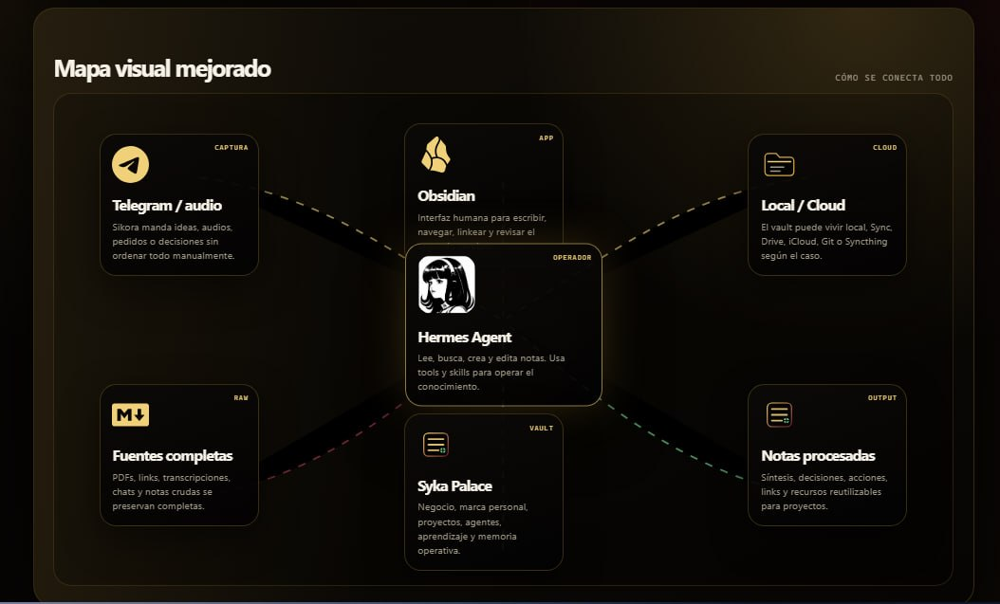

# Obsidian Setup Consultant — Hermes Skill

Una skill para Hermes Agent que ayuda a instalar, diseñar y conectar Obsidian como segundo cerebro, base de conocimiento o memoria legible por agentes IA.


## Qué hace

Esta skill guía a un agente Hermes para ayudar a una persona a crear un vault de Obsidian que sea útil de verdad: simple, ordenado, capturable y fácil de leer tanto para humanos como para agentes.

Sirve para:

- instalar y entender Obsidian desde cero;
- diseñar una estructura de vault clara;
- elegir carpetas, flujo de captura y plugins;
- separar fuentes completas de notas procesadas;
- conectar Hermes con Obsidian usando archivos Markdown;
- preparar un sistema que pueda funcionar como memoria personal, base de investigación o knowledge base para agentes.

## Idea central

Obsidian no es una app cerrada: es una carpeta de archivos Markdown.

Eso permite que:

- una persona escriba, navegue y conecte ideas visualmente;
- Hermes pueda leer, buscar, crear y editar notas con herramientas de archivos;
- el sistema funcione como una memoria persistente entre sesiones.

## Instalación rápida

Con Hermes instalado, podés instalar la skill desde este repositorio:

```bash
hermes skills install https://raw.githubusercontent.com/SikJa/hermes-obsidian-setup-consultant/main/skill/obsidian-setup-consultant/SKILL.md
```

Después, dentro de una conversación con Hermes:

```text
/skill obsidian-setup-consultant
```

También podés copiar manualmente la carpeta:

```text
skill/obsidian-setup-consultant/
```

a tu carpeta de skills:

```text
~/.hermes/skills/obsidian-setup-consultant/
```

Si usás perfiles:

```text
~/.hermes/profiles/TU_PERFIL/skills/obsidian-setup-consultant/
```

## Cómo se usa

Ejemplo de prompt:

```text
Quiero crear un vault de Obsidian para mi negocio, mis proyectos y mi memoria de IA. Guiame paso a paso y haceme las preguntas necesarias antes de proponer la estructura final.
```

La skill primero hace 10 preguntas de descubrimiento y después propone:

- resumen del caso;
- setup recomendado;
- estructura de carpetas;
- flujo de captura;
- plugins mínimos y opcionales;
- guía de sincronización/cloud;
- patrón de conexión Hermes ↔ Obsidian;
- templates base;
- checklist de instalación.

## Recursos visuales

### Mapa conceptual



También incluimos una demo HTML visual:

- [`demo/hermes-obsidian-connection.html`](demo/hermes-obsidian-connection.html)

Y un super prompt para usar en descripciones de video:

- [`docs/super-prompt-instalar-obsidian-hermes.md`](docs/super-prompt-instalar-obsidian-hermes.md)

## Ejemplos y validación

- [`examples/founder-creator-vault.md`](examples/founder-creator-vault.md) — ejemplo de vault para founders, creadores y consultores.
- [`docs/vault-validation-checklist.md`](docs/vault-validation-checklist.md) — checklist para validar que el vault sea útil para humanos y agentes.
- [`CONTRIBUTING.md`](CONTRIBUTING.md) — guía para reportar mejoras, sumar ejemplos y mantener la skill simple.
- [`CHANGELOG.md`](CHANGELOG.md) — historial de cambios del proyecto.

## Estructura del repo

```text
skill/obsidian-setup-consultant/SKILL.md  # skill principal
assets/                                   # imágenes y recursos visuales
demo/                                     # demo HTML
docs/                                     # prompts, checklist y documentación
examples/                                 # ejemplos de vaults por caso de uso
CONTRIBUTING.md                           # guía para colaborar
CHANGELOG.md                              # historial de cambios
```

## Para quién es

Para creadores, founders, estudiantes, investigadores y personas que quieren usar Obsidian como memoria personal o profesional, especialmente si también quieren conectar agentes IA como Hermes.

## Créditos

Creado por Sikora / Syka Lab junto a Elen, perfil Hermes de marca personal.

Hermes Agent: https://hermes-agent.nousresearch.com/docs/
Obsidian: https://obsidian.md/
